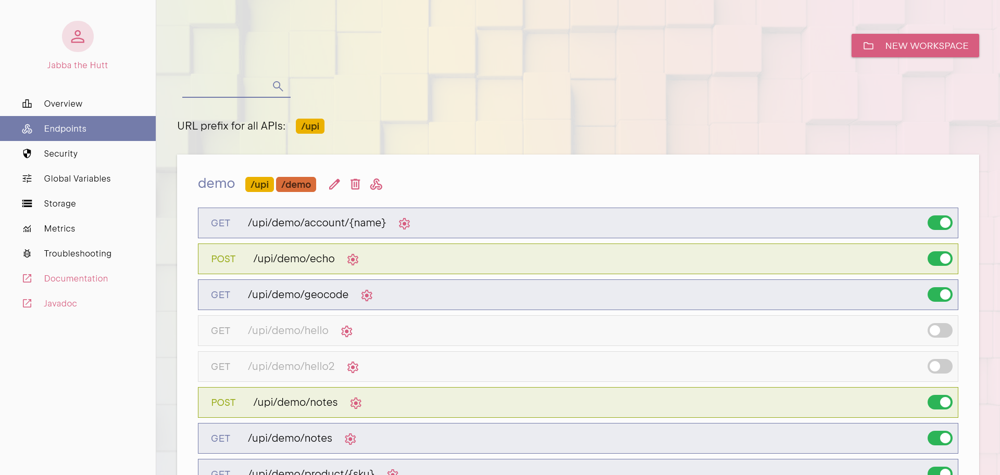
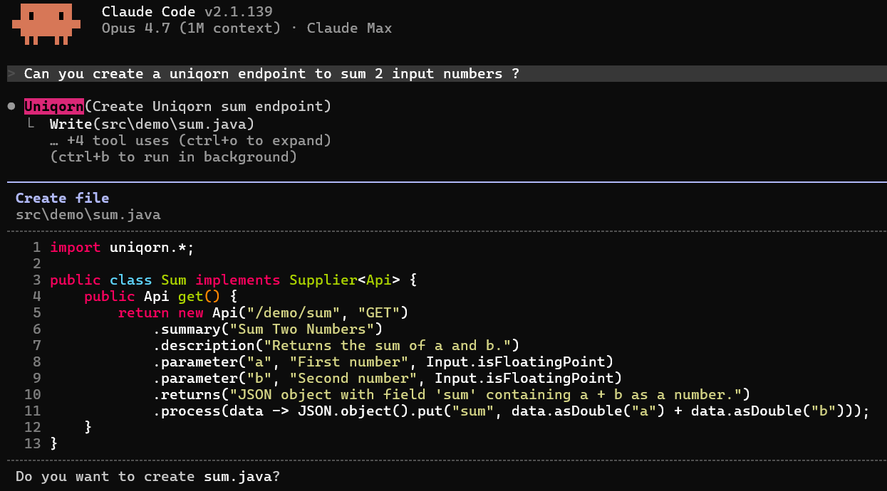

<h1 align="center">
  <a href="https://uniqorn.dev"></a><br />
  Serverless Java REST APIs
</h1>

<p align="center">
  Push code, be live.<br />
  No build. No container. No restart.
</p>

Built for developers who'd rather ship than configure.

## What an endpoint looks like

One file. No project layout, no annotations soup, no build step:

```java
import uniqorn.*;

public class Hello implements Supplier<Api> {
  public Api get() {
    return new Api("/hello", "GET")
      .summary("Greet a name")
      .allowGroup("users")
      .parameter("name", "Who to greet")
      .process(data -> JSON.object().put("hello", data.get("name")));
  }
}
```

Save it, push it. The runtime compiles the source, hot-swaps it, and the next
request hits the new version.

The same definition is also an MCP tool. The `summary` and `parameter` strings
describe it for AI agents and for humans, security applies globally.
Nothing else to write.



## Hot-reload

Two consecutive requests on the same keep-alive connection, with a deploy in
between:

```text
GET  /upi/test/hello
     {"success": true, "version": 1}

# git push origin main
remote: ---------------
remote: Done: created=0 updated=1 removed=0 ignored=0 error=0 in 135ms
remote: ---------------

GET  /upi/test/hello?name=World
     {"success": true, "hello": "World", "version": 2}
```

Between the two requests we added a `name` parameter and a `hello` response
field. A live endpoint's schema changed without a restart and without dropping
memory states and in-flight traffic. 

> It's a double-edged blade, and it's addictive.

Keep what works: canaries, reviews, rollbacks. And hot-patch for the cases 
where a restart would erase what you're trying to fix, like a bug that won't 
reproduce in a lab.

## Why Uniqorn?

Modern JVM frameworks like Spring Boot, Micronaut, Quarkus, and Helidon all
assume the same production lifecycle: code > build > container > restart.
Some ship dev-mode live reload as a workaround for the inner loop, 
but production still means rebuilding an artifact and recycling a process.
The build pipeline exists to bridge the gap between "I edited a file" 
and "the new version is live."

Tools like JRebel reload classes in a running JVM, but they attach to
existing apps as a dev-time affordance, not as a production deploy path.
  
Lambda and Serverless solve a different problem: ops. You write a
function, the platform runs it. The price is cold starts, function-sized
thinking, and a runtime you don't control.

Uniqorn picks a third path: keep Java, drop the pipeline. The runtime compiles
your source on push and hot-swaps the bytecode in a fresh classloader, 
atomically, with the previous version still serving until the new one is ready. 
Hot-reload isn't a dev affordance, it's how production works.

We didn't try to hide the pipeline. We removed it.

## What's in the box

One process:

- **Hot-reload runtime**: push-to-live in ~200&nbsp;ms, no downtime
- **HTTP server**: built in, no reverse proxy or sidecar
- **Git remote**: your endpoints live in git, `git push` deploys them
- **Static hosting**: serve your whole frontend from the instance root, pretty urls and custom 404 included
- **MCP server**: every endpoint is also an MCP tool, no wrapper, no extra layer
- **Admin panel**: OIDC, MFA, role-based access
- **Storage and SQL primitives**: with monitoring and rate-limiting
- **Logging and monitoring**: unified, streamed to the web console

Not in the box: just the JRE. Bring your own Java 11, 17, 21, 25+, or in-between.

## Try it

**Hosted trial.** Sign up at [uniqorn.dev](https://uniqorn.dev) and we run the
instance for you. Browser only, nothing to install.

**Local.** Grab the demo release, unpack it, and start in demo mode:

```bash
./run.sh --demo
```

Open `https://localhost:8443/` (self-signed cert).

The `--demo` flag boots from a pre-baked snapshot with shared keys, so the first
run is friction-free. Do not run it on anything that isn't your laptop.

See the release `README.md` for the full first-run
walkthrough, connecting git, and wiring up MCP.

## Documentation

- [uniqorn.dev/doc](https://uniqorn.dev/doc): concepts and guides
- [uniqorn.dev/javadoc](https://uniqorn.dev/javadoc): full API reference
- `AGENT.md`: prompt context for an AI agent that writes Uniqorn endpoints



## License

Uniqorn is split-licensed.

- The Uniqorn layer (the API surface, the developer experience, and the
  examples in this repository) is **Apache 2.0**. Fork it, extend it, ship it.
- The runtime core (Aeonics) is **source-available**, free for personal,
  evaluation, and non-commercial use.

Full terms in `LICENSE.md`.
Commercial pricing on [uniqorn.dev](https://uniqorn.dev).

## Contributing

Contributions are welcome and governed by internal project guidelines around
security, sovereignty, and eco-design. Open an issue, send a pull request, or
share an idea, we read everything. No bots.

## Security

Uniqorn runs your code. Only people with contributor access can push, so
the trust boundary is git auth, not sandboxing.

In a self-hosted deployment, you own the system and you control what runs.
On our hosted instances, we impose
[code restrictions](https://uniqorn.dev/doc#start-restrict) and isolation
so accidental footguns can't compromise the host or other tenants.

If you see something, say something. Disclosure in `SECURITY.md`. SBOM in `bom.json`.

## Contact

Questions, complaints, kind words: [contact@uniqorn.dev](mailto:contact@uniqorn.dev)
